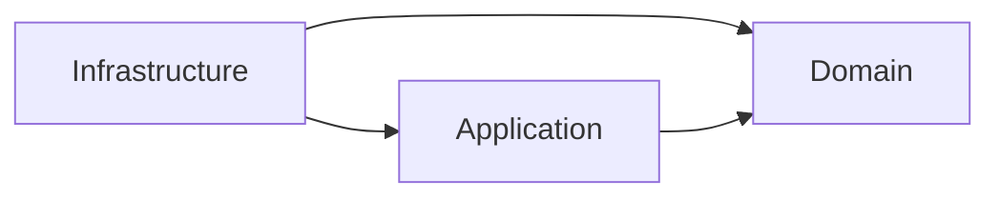

# Symfony DDD demo — loan eligibility service

[](https://github.com/selivanov-tech/symfony-ddd-demo/actions/workflows/ci.yml)

A small **Symfony 7.1** backend that shows a clean **Domain-Driven Design** layout with
**CQRS** message buses. It models a simple lending flow: create customers, define loan
products, and check whether a customer is eligible for a loan.

This is a reference / demo project. The goal is to show architecture and code style,
not to be a finished product.

## What it does

- **Customers** — create, read, and update a customer (email, phone, SSN, birthday,
  FICO score, monthly income, US address).
- **Loan products** — each product has its own rules: minimum FICO score, minimum
  monthly income, an age range, allowed US states, and per-state score multipliers.
- **Loan eligibility** — check a customer against a product. A domain service runs all
  the rules and returns *eligible* or *denied* with a clear reason.
- **Loan decisions & events** — applying for a loan builds a `Loan` aggregate that
  records a domain event (`LoanApproved` / `LoanRejected`). The event bus then drives a
  notification (multi-channel, e.g. email / SMS).

## Architecture

Three layers with a **one-way** dependency direction, checked on every build by deptrac:



- **Domain** — the business core: entities, the `Loan` aggregate, value objects
  (`Money`, `Address`), domain events, and the eligibility rules. No framework logic;
  randomness and persistence sit behind **ports** (interfaces) defined here.
- **Application** — the use cases, as **commands** and **queries** with one handler each.
  Handlers orchestrate the domain and the ports; controllers never touch the domain
  directly.
- **Infrastructure** — the adapters: HTTP controllers, Doctrine repositories + a `Money`
  custom type, the Messenger bus adapters, and notifications.

### CQRS buses

The app dispatches every use case over one of three [Symfony Messenger](https://symfony.com/doc/current/messenger.html)
buses behind small ports (`CommandBusInterface` / `QueryBusInterface` / `EventBusInterface`):

| Bus | For | Handlers |
|---|---|---|
| `command.bus` | writes (change state) | exactly one |
| `query.bus` | reads (return a view model) | exactly one |
| `event.bus` | domain events | zero-to-many (fan-out) |

Everything runs **synchronously in-process** today. Nothing about the code assumes that:
routing domain events to an async transport (or a transactional outbox) is a change in
`config/packages/messenger.yaml`, not in the handlers.

### A write request, end to end


### Layout

```
src/
├── Domain/                    # business core — no framework code in the rules
│   ├── Customer/              # Customer entity, Address VO, repository interface
│   ├── Loan/                  # Loan aggregate, domain events, eligibility rules, ports
│   └── Product/               # Product entity, state score-multiplier value objects
├── Application/               # use cases on the buses
│   ├── Customer/              # Create/Update commands, GetCustomer query, CustomerView
│   ├── Loan/                  # ApplyForLoan command, CheckEligibility query, event handler
│   └── Notification/          # NotificationSender port
├── Infrastructure/            # framework & I/O (adapters)
│   ├── Http/Controller/       # thin controllers — validate + dispatch
│   ├── Persistence/Doctrine/  # repositories + the Money custom type
│   └── Service/               # notifications + the random NY lottery
└── Shared/                    # shared kernel
    ├── Domain/                # AggregateRoot, DomainEvent, Money
    ├── Application/           # bus ports + transaction port
    └── Infrastructure/        # Messenger bus adapters, Doctrine transaction manager
```

## Tech stack

- PHP 8.2+ · Symfony 7.1 (framework-bundle, messenger, serializer, validator, uid, notifier)
- Doctrine ORM 3 + migrations (with a `Money` custom DBAL type)
- SQLite by default (PostgreSQL-ready — see `DATABASE_URL` in `.env`)
- Docker + Docker Compose, with `make` helpers
- Quality: PHPUnit (unit + feature), PHPStan (level 6), PHP-CS-Fixer, deptrac, GitHub Actions CI

## Run it

```bash
make start      # build & start the PHP container (Symfony on :8000)
make db-init    # create the database and schema
# or: make db-migrate   to run the migrations instead
```

The app runs at `http://localhost:8000`.

### API (v0)

| Method | Path | What it does |
|---|---|---|
| `POST`  | `/customer/create` | create a customer |
| `GET`   | `/customer/{id}`   | get a customer (curated view model) |
| `PATCH` | `/customer/{id}`   | update a customer |
| `GET`   | `/loan/apply`      | check loan eligibility |

Ready-to-run request samples are in [`http/v0/`](http/v0/) (JetBrains HTTP client
format). Run them with `make tests-http`.

## Quality & CI

One command runs every quality gate — code style, static analysis, architecture, and tests:

```bash
make ready
```

It runs, in order:

| Gate | Command | What it checks |
|---|---|---|
| Code style | `make cs-check` (`make cs-fix` to apply) | PHP-CS-Fixer (`@PSR12` + safe rules) |
| Static analysis | `make phpstan` | PHPStan level 6 |
| Architecture | `make deptrac` | layer rules (Domain ← Application ← Infrastructure) |
| Tests | `make test` (`test-unit` / `test-feature`) | PHPUnit suites |

Tests are split into two suites:

- **`tests/Unit/`** — fast, no container or DB (domain rules, value objects, aggregate
  events, bus adapters, handlers).
- **`tests/Feature/`** — boot the kernel and hit the HTTP API (and Doctrine) against a
  throwaway SQLite schema.

**CI** ([`.github/workflows/ci.yml`](.github/workflows/ci.yml)) runs each gate as a
**separate, parallel job** (`php-cs-fixer`, `phpstan`, `deptrac`, `unit tests`,
`feature tests`) on every push and pull request. Each job reuses the matching `make`
target (`make <target> PHP_RUN=`), so local and CI run the same commands — `make ready`
is just the local shortcut that runs them all in one go.

A few notes on the setup:

- **PHPStan baseline.** `phpstan-baseline.neon` captures pre-existing findings so the
  build is green today while new code is held to level 6. Burn it down over time.
- **Isolated tools.** PHP-CS-Fixer and deptrac each live in their own composer project
  under `tools/` so their dependencies can't clash with the app's Symfony 7.1 pin.

## Notes

- `.env` holds **non-secret dev defaults** only. Put real secrets in `.env.local`
  (git-ignored) or in real environment variables — never commit them.
- Some `// todo:` comments mark known simplifications (for example, the address is
  stored as JSON and the US states are hard-coded) kept on purpose to keep the focus
  on the architecture.
