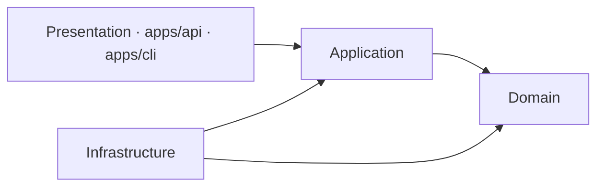
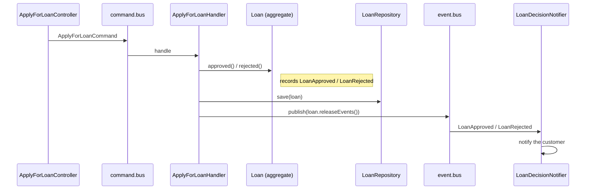

# Symfony DDD demo — loan eligibility service

[](https://github.com/selivanov-tech/symfony-ddd-demo/actions/workflows/ci.yml)

A small **Symfony 7.4** backend that shows a clean **Domain-Driven Design** layout with
**CQRS** message buses. It models a simple lending flow: create customers, define loan
products, and check whether a customer is eligible for a loan.

This is a reference / demo project. The goal is to show architecture and code style,
not to be a finished product.

## What it does

- **Customers** — create, read, and update a customer (email, phone, SSN, birthday,
  FICO score, monthly income, US address).
- **Loan products** — each product has its own rules: minimum FICO score, minimum
  monthly income, an age range, allowed US states, and per-state score multipliers.
- **Loan eligibility** — check a customer against a product. A domain service runs all
  the rules and returns *eligible* or *denied* with a clear reason.
- **Loan decisions & events** — applying for a loan builds a `Loan` aggregate that
  records a domain event (`LoanApproved` / `LoanRejected`). The event bus then drives a
  notification through a swappable `NotificationSenderInterface` port — the demo ships a
  logging adapter (no external service); a real Mailer/SMS adapter drops in behind the
  same port.

## Architecture

A **modular monolith**: one folder per **bounded context** (`Customer`, `Product`,
`Loan`), each with its own Domain / Application / Infrastructure layers. A **shared
kernel** (`src/Shared/`) holds cross-cutting building blocks, and the **presentation
layer** lives outside `src/` in `apps/` — one app per transport (`api`, `cli`). deptrac
enforces two rules on every build:

- **Layers** flow one way: `Domain ← Application ← Infrastructure`, with `Presentation`
  (the apps) on top.
- **Modules** are isolated: a module's Domain and Application may depend only on the
  shared kernel, never on another module. Cross-module integration is allowed **only
  from the Infrastructure layer**.



- **Domain** — the business core: entities, the `Loan` aggregate, value objects
  (`Email`, `Money`, `Address`, …), domain events, and the eligibility rules. No
  framework logic; randomness and persistence sit behind **ports** (interfaces) defined
  here.
- **Application** — the use cases, as **commands** and **queries** with one handler each.
  Handlers orchestrate the domain and the ports.
- **Infrastructure** — the adapters: Doctrine repositories, value-object DBAL types, the
  Messenger bus adapters, and notifications.
- **Presentation** (`apps/`) — thin entrypoints per transport: HTTP controllers in
  `apps/api` (one invokable controller per action), console commands in `apps/cli`. They
  validate input and dispatch onto the buses; they never touch the domain directly.

### CQRS buses

The app dispatches every use case over one of three [Symfony Messenger](https://symfony.com/doc/current/messenger.html)
buses behind small ports (`CommandBusInterface` / `QueryBusInterface` / `EventBusInterface`):

| Bus | For | Handlers |
|---|---|---|
| `command.bus` | writes (change state) | exactly one |
| `query.bus` | reads (return a view model) | exactly one |
| `event.bus` | domain events | zero-to-many (fan-out) |

Everything runs **synchronously in-process** today. Nothing about the code assumes that:
routing domain events to an async transport (or a transactional outbox) is a change in
`config/packages/messenger.yaml`, not in the handlers.

### A write request, end to end



### Layout

```
src/
├── Module/                     # one folder per bounded context
│   ├── Customer/               # profile + value objects (Email, Phone, SSN, FICO, Address)
│   │   ├── Domain/             #   entity, value objects, repository interface
│   │   ├── Application/        #   Create/Update commands, GetCustomer query, request DTOs
│   │   └── Infrastructure/     #   Doctrine repository + value-object DBAL types
│   ├── Product/                # loan products and per-state score-multiplier rules
│   │   ├── Domain/
│   │   ├── Application/
│   │   └── Infrastructure/
│   └── Loan/                   # Loan aggregate, eligibility rules, decisions & events
│       ├── Domain/             #   aggregate, domain events, eligibility service, ports
│       ├── Application/        #   ApplyForLoan command, CheckEligibility query, event handler
│       └── Infrastructure/     #   Doctrine repository, random NY lottery adapter
└── Shared/                     # shared kernel (used by every module)
    ├── Domain/                 #   AggregateRoot, DomainEvent, Uuid, Money
    ├── Application/            #   bus ports, transaction port, notification port
    └── Infrastructure/         #   Messenger bus adapters, transaction manager, shared DBAL types

apps/                           # presentation layer — one app per transport
├── api/src/                    #   HTTP controllers + API exception handling
└── cli/src/                    #   console commands (e.g. app:loan:check-eligibility)
```

## Tech stack

- PHP 8.2+ · Symfony 7.4 (framework-bundle, messenger, serializer, validator, uid, notifier)
- Doctrine ORM 3 + migrations (value objects persisted via custom DBAL types)
- SQLite by default (PostgreSQL-ready — see `DATABASE_URL` in `.env`)
- Docker + Docker Compose, with `make` helpers
- API docs: **OpenAPI 3** via NelmioApiDocBundle + **Swagger UI** at `/api/doc` (Twig-rendered)
- Quality: PHPUnit (unit + feature), PHPStan (level 6), PHP-CS-Fixer, deptrac, GitHub Actions CI

## Run it

```bash
make start      # build & start the PHP container (Symfony on :8000)
make db-init    # create the database and schema
# or: make db-migrate   to run the migrations instead
```

The app runs at `http://localhost:8000`.

### API (v0)

Every endpoint is a single-action **invokable controller**. The API is described by an
**OpenAPI 3** spec with an interactive **Swagger UI** — browse it at `/api/doc` (run
`bin/console assets:install public` once if the UI assets are missing).

| Method | Path | What it does |
|---|---|---|
| `POST`  | `/customer/create`   | create a customer |
| `GET`   | `/customer/{id}`     | get a customer (curated view model) |
| `PATCH` | `/customer/{id}`     | update a customer |
| `GET`   | `/loan/eligibility`  | check loan eligibility |
| `POST`  | `/loan/applications` | apply for a loan |
| `GET`   | `/api/doc`           | Swagger UI (interactive docs) |
| `GET`   | `/api/doc.json`      | OpenAPI 3 spec (JSON) |

Ready-to-run request samples are in [`http/v0/`](http/v0/) (JetBrains HTTP client
format). Run them with `make tests-http`.

A matching CLI app lives in `apps/cli` — for example, run an eligibility check from the
console (it dispatches the same `CheckLoanEligibilityQuery` on the query bus):

```bash
bin/console app:loan:check-eligibility <productId> <customerId>
```

## Quality & CI

One command runs every quality gate — code style, static analysis, architecture, and tests:

```bash
make ready
```

It runs, in order:

| Gate | Command | What it checks |
|---|---|---|
| Code style | `make cs-check` (`make cs-fix` to apply) | PHP-CS-Fixer (`@PSR12` + safe rules) |
| Static analysis | `make phpstan` | PHPStan level 6 |
| Architecture | `make deptrac` | layer rules + per-module boundaries (cross-module only via Infrastructure) |
| Tests | `make test` (`test-unit` / `test-feature`) | PHPUnit suites |

Tests are split into two suites:

- **`tests/Unit/`** — fast, no container or DB (domain rules, value objects, aggregate
  events, bus adapters, handlers).
- **`tests/Feature/`** — boot the kernel and hit the HTTP API (and Doctrine) against a
  throwaway SQLite schema.

**CI** ([`.github/workflows/ci.yml`](.github/workflows/ci.yml)) runs each gate as a
**separate, parallel job** (`php-cs-fixer`, `phpstan`, `deptrac`, `unit tests`,
`feature tests`) on every push and pull request. Each job reuses the matching `make`
target (`make <target> PHP_RUN=`), so local and CI run the same commands — `make ready`
is just the local shortcut that runs them all in one go.

A few notes on the setup:

- **PHPStan baseline.** `phpstan-baseline.neon` captures pre-existing findings so the
  build is green today while new code is held to level 6. Burn it down over time.
- **Isolated tools.** PHP-CS-Fixer and deptrac each live in their own composer project
  under `tools/` so their dependencies can't clash with the app's Symfony 7.4 pin.
- **Module boundaries.** A layer config (`deptrac/layers.yaml`) plus one boundary config
  per module (`deptrac/module-*.yaml`) keep modules isolated; cross-module calls are
  allowed only from Infrastructure. The loan eligibility flow reaches Customer/Product
  through an **anti-corruption layer**: Loan defines its own read-model ports
  (`Application/Repository/*ReadModelRepositoryInterface`) returning Loan-owned DTOs, and the
  adapters that map the foreign aggregates live in Loan's Infrastructure. So Loan's
  Domain/Application stay clean and the boundary holds with **no baselined violations**.

## Notes

- `.env` holds **non-secret dev defaults** only. Put real secrets in `.env.local`
  (git-ignored) or in real environment variables — never commit them.
- Some `// todo:` comments mark known simplifications (for example, the address is
  stored as JSON and the US states are hard-coded) kept on purpose to keep the focus
  on the architecture.
